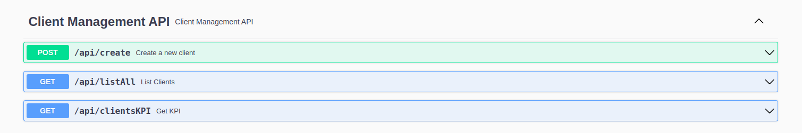

# PinApp Client Microservice

This is a Spring Boot microservice for managing clients. The microservice provides endpoints to create clients, calculate the average and standard deviation of client ages, and list all clients along with their probable date of death.

## Table of Contents

- [Requirement](#Requirement)
- [Architecture overview](#Architecture)
- [Scaling](#Scaling)
- [API Endpoints](#api-endpoints)
- [Prerequisites](#prerequisites)
- [Running Locally](#running-locally)

## Requirement

`````Desafío a resolver de microServicios:
1.Microservicio desarrollado en JAVA Spring boot

2.API Rest documentada en Swagger

3.Deployado en AWS o algún CLOUD + código subido en GITHUB 

**Endpoint de Entrada POST** 

/creacliente

Nombre
Apellido
Edad
Fecha de nacimiento

**Endpoint de salida GET** 

/kpideclientes

Promedio edad entre todos los clientes
Desviación estándar entre las edades de todos los clientes


**Endpoint de salida GET** 

/listclientes
Lista de personas con todos los datos + fecha probable de muerte de cada una
`````


------------------
## Architecture
- **Spring Boot Application:** Acts as the central component handling web requests, business logic, and integration with other services.
- **MongoDB Embedded**: Stores all event data persistently, allowing efficient querying and retrieval.
- **Caffeine cache**: Caches event data to provide faster access times during high traffic.
- **RabbitMQ**: (not implemented) Queues incoming requests to decouple the request reception from processing, enhancing scalability and fault tolerance.
- **Cloud Infraestructure**: This project uses Docker for containerization, Kubernetes for container orchestration and management, and Google Cloud Platform (GCP) to deploy and scale the application in a secure and robust cloud environment. Utilizing these technologies ensures efficient, scalable, and highly available deployment.

Notes:
- Queues: not implemented but current app architecture can easily adapt to the technology
- Cache: The idea to use Redis wich is more versatile and powerful solution, particularly in complex, distributed applications where cache coherence, persistence, and complex data manipulations are required. But we use Caffeine for practical purposes

## Scaling
- implement load balancing across multiple service instances.
- Use database sharding or replication to handle large datasets and high traffic.
- Deploying in a containerized environment using Docker and Kubernetes for easy scaling and management.
--------------------

## Api-endpoints



Look for API Documentation by [following this link](http://34.133.117.46/swagger-ui/index.html#/)


#### curl examples    
    curl --location --request POST 'http://34.133.117.46/api/create' \
    --header 'Content-Type: application/json' \
    --data-raw '{
    "name": "John",
    "lastName": "Deep",
    "age": 30,
    "birthDate": "1994-01-01"
    }'
--

    `curl --location --request GET 'http://34.133.117.46:80/api/clientsKPI'`
------------

## Prerequisites

- Java 17 SDK
- Postman
- IntellijIDEA

--------------

## Running Locally

1. Clone the repository:
   ```sh
   git clone https://github.com/ghoyos95/PinApp.git
   cd PinApp

2. Run on terminal
    ```sh
   ./gradlew clean build
   ./gradlew bootRun
    
or 

3. Debug Mode on Intellij
   1. Open IDE
   2. Open project -> pinapp
   3. Gradle will automatically start indexing dependencies
   4. Click on Run debug...


4. Check availability on: 
    ```sh
   localhost:8080/swagger-ui/index.html
   
